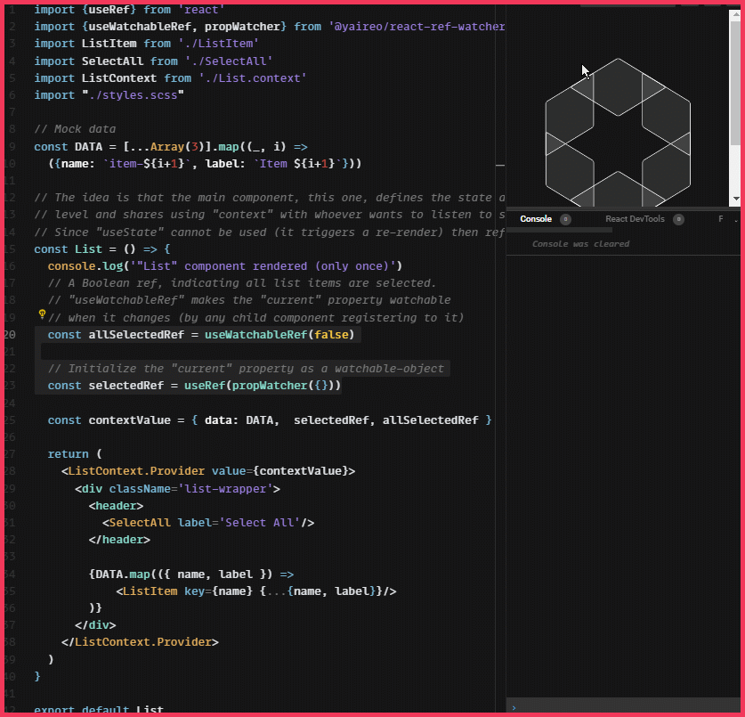

<p align="center">
  <a href="https://codesandbox.io/s/ref-change-listener-m5bupr?file=/src/List.js">
    
  </a>
</p>
<h3 align="center">Watch <code>ref</code> changes with conditional re-renders</h3>
<p align='center'>(First draft - expect changes) <a href='https://codesandbox.io/s/ref-change-listener-m5bupr?file=/src/List.js'>Live demo</a></p>

---
<p align="center">
  <a href="https://codesandbox.io/s/ref-change-listener-m5bupr?file=/src/List.js">
    
  </a>
</p>

Keep (or place) all the state at parent-component-level, as refs, and pass it to the sub-components with props or context.<br>
(I prefer context so deeply nested comopnents can access the state without drilling-down the props).

This solves the problem where a child updates a state defined at some top-parent level which is causing the parent to re-render.

Each sub-component can register a listener for changes in a specific `ref` or any of its `.current` properties (assuming `current` points to a mutated Object/Array).

## Install:

Use from [CDN](https://unpkg.com/@yaireo/\useSmartRef) / Download from this repo / [NPM](https://www.npmjs.com/package/@yaireo/\useSmartRef)

```bash
npm i @yaireo/\useSmartRef -S
```

## What's in this package?

### `useWatchableRef`

| Argument      | Type  | Info
|---------------|-------|-------------------------------------------------------------
| initialValue  | Any   | Same as the native `useRef`

Create a ref-like object that listens to any change in the `current` property
and fires all registered callbacks when a change happens to the `current` property.

```js
import {useSmartRef} from '@yaireo/react-ref-watcher'

const Component = () => {
  const myRef = useSmartRef(true)
}
```

### `useWatchableListener`

| Argument | Type     | Info
|----------|----------|-------------------------------------------------------------
| ref      | Object   | an Object/Array to listen to
| propName | String   | (optional) specific property name to watch within the `ref`
| watcher  | function | (optional) argument, for custom watcher

Listens to refs changes.
By default will trigger a re-render in the component which is using this hook if
a change in the ref itself or specific property is detected.

```js
import {useWatchableListener} from '@yaireo/react-ref-watcher'

const Component = ({ ref1 }) => {
  const {ref2} = useContext(MyContext) // getting a ref from somewhere up the tree

  useWatchableListener(ref1) // triggers a re-render when ref1 changes (assuming the `ref1.current` is pointing now a new pointer in memory)
  useWatchableListener(ref2.current, 'foo') // triggers a re-render when `foo` property changes in ref2.current (assuming ref2.current is an Object)
}
```


### `useWatchableEffect`

| Argument      | Type     | Info
|---------------|----------|-------------------------------------------------------------
| callback      | Function | fires when a ref change detetced
| dependencies  | Array    | array of watchable "smart" refs

Listen to changes in a ref **without** triggering a re-render

```js
import {useWatchableEffect, useSmartRefListener} from '@yaireo/react-ref-watcher'

const Component = ({ ref1, ref2 }) => {
  useWatchableEffect(() => {
    ref2.current = ref1 === 'foo';
  }, [ref1])

  // ref2 is dependend on ref1. Only when ref2 changes the component should re-render
  useSmartRefListener(ref2)
}
```


### `propWatcher`

Unlike the other hooks, this is a utility function which does the actual watching.
It adds an enumerable `__WATCHERS` property (an Object of possible listeners) on top of the argument (an *Object*) and then
returns a new `proxy` which encapsulates the argument.

Every time a propery is modified or deleted (in your code) the proxy trap will fire and all
callback functions defined in the `__WATCHERS` property will fire.

**Example of most basic usage:**

```js
import {propWatcher} from '@yaireo/react-ref-watcher'

const watchableRef = propWatcher({ current: true })
```


